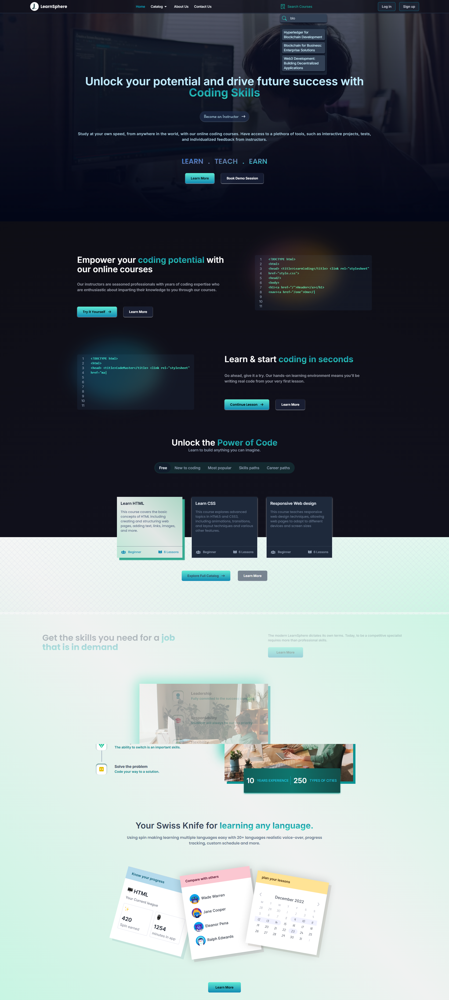
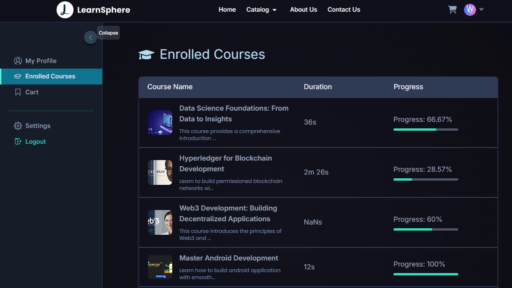
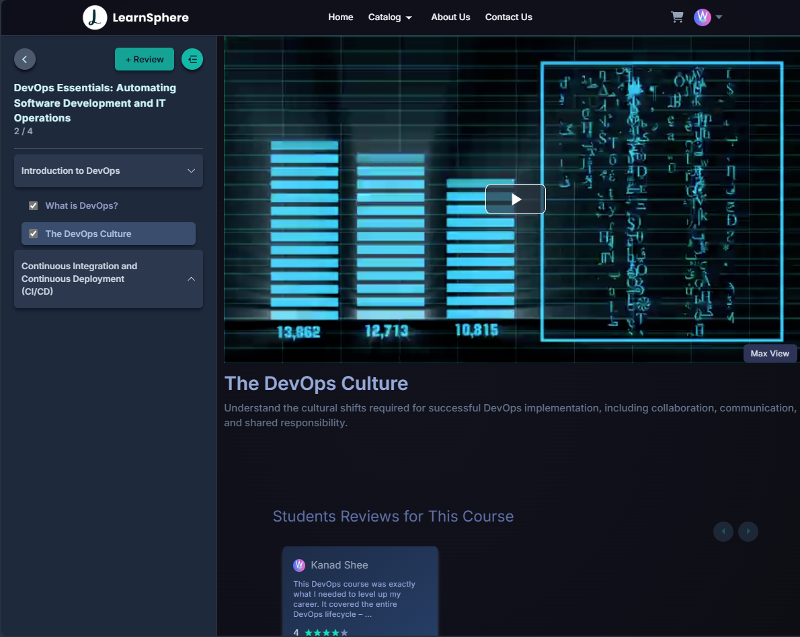
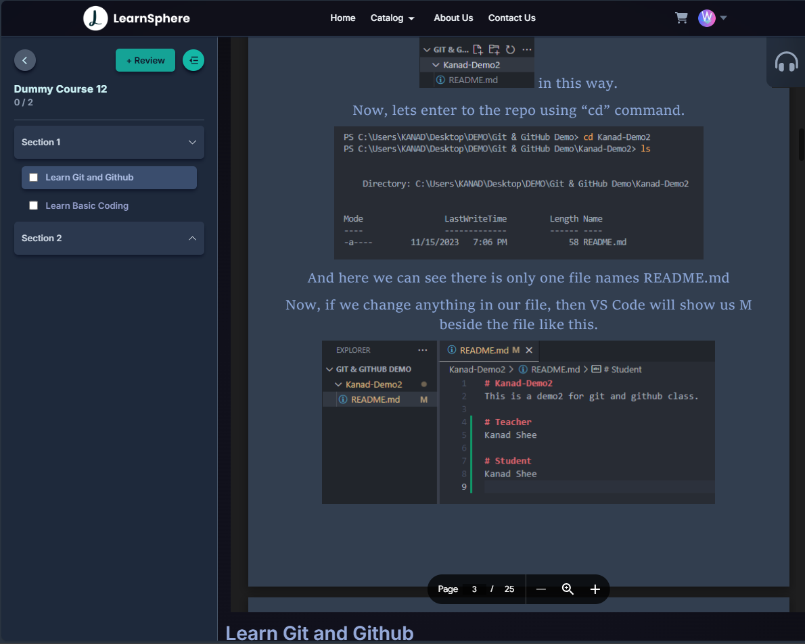
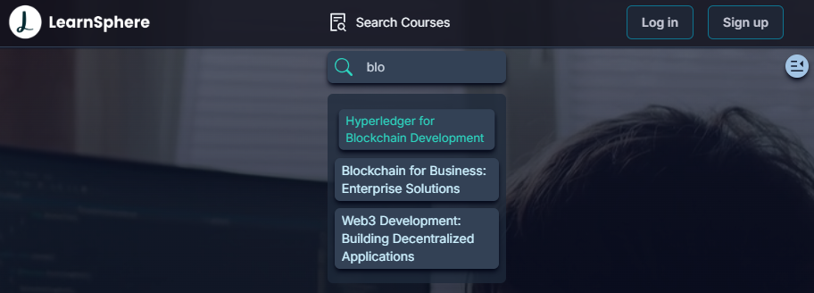
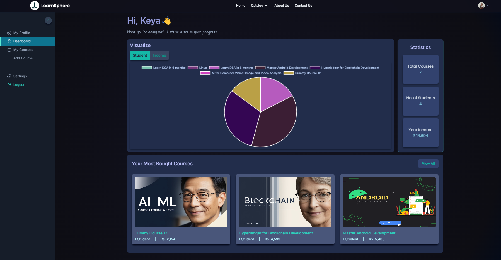
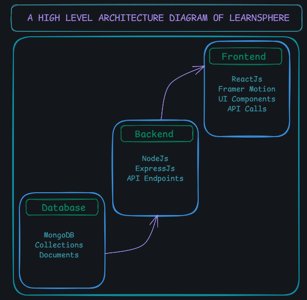

# LearnSphere - an EdTech Platform

🔗 [Visit my website](https://learn-sphere-edui.vercel.app)

---

## Table Of Contents:

- [Introduction](#introduction)
- [System Architecture](#system-architecture)
- [Frontend](#front-end)
- [StudentsPages](#pages-for-students)
- [Search Box](#search-box-functionality-debouncing)
- [InstructorPages](#pages-for-instructors)
- [Frontend-Tools](#front-end-tools-and-libraries)
- [Backend](#back-end)
- [Database](#data-models-and-database-schema)
- [Api-Design](#api-design)

---

## Introduction

LearnSphere is a comprehensive EdTech platform created to provide an accessible, engaging, and interactive learning experience. It aims to make education more widely available by connecting students and instructors globally. The platform allows instructors to share their expertise through various content formats, including videos and PDFs, enabling learners to access high-quality educational material. The collaborative environment fosters communication and knowledge exchange, enhancing the overall learning experience.

This document outlines the technical framework behind LearnSphere, detailing the system architecture, API design, and the processes involved in setting up and using the platform. It also provides instructions for deployment and usage, ensuring a smooth setup for both developers and users. Furthermore, the document highlights potential areas for future improvements, including scaling the platform, adding new features, and enhancing performance, to continuously evolve and meet the growing needs of the educational community.

---

## System Architecture

The LearnSphere platform follows a client-server architecture, consisting of three main components: the front end, the back end, and the database. The front end serves as the client, providing the user interface and enabling interaction with the platform. It communicates with the back end, which processes requests, handles business logic, and manages interactions with the database. The database stores and organizes all data related to the platform, including user information, courses, student progress, and payment records.

The server components—back end and database—work together to facilitate seamless data exchange, ensure secure transactions, and support the functionality required by users. This architecture ensures that LearnSphere is scalable, efficient, and able to deliver a dynamic, responsive learning experience for both students and instructors.

---

## Front End

The front end of LearnSphere is developed using ReactJS, a powerful JavaScript library for building user interfaces. ReactJS allows for the creation of dynamic and highly responsive web pages, enabling real-time updates and interactions with minimal reloading. This provides an intuitive and seamless user experience, which is essential for a platform focused on learning and engagement.

To ensure smooth and efficient communication between the front end and the back end, RESTful API calls are employed. These API calls allow the front end to request data from the back end, such as course details, user progress, and payment statuses. The responses are then used to update the UI in real-time, ensuring that users always have access to the latest information without the need for manual refreshes.

Additionally, Framer Motion is integrated into the front end to enhance the platform's interactivity. This library is used to create smooth animations and transitions, adding a dynamic touch to the user interface. Whether it's animating buttons, transitions between pages, or revealing elements on scroll, Framer Motion helps deliver a visually appealing experience that keeps the user engaged throughout their journey on LearnSphere.

Together, ReactJS, RESTful APIs, and Framer Motion work cohesively to deliver a modern, dynamic, and interactive learning platform that prioritizes user experience and smooth performance.

---

### Pages for Students

- **Homepage**: Provides a brief overview of the platform, with links to the course catalog and user profile.
- **Course List**: Displays available courses, along with descriptions and ratings.
- **Wishlist**: Shows all courses a student has added to their wishlist.
- **Cart Checkout**: Supports purchasing and enrolling in courses.
- **Course Content**: Contains the video lessons and related materials for each course.
- **User Details**: Displays the student’s account details, such as name and email.
- **User Edit Details**: Allows students to update their personal information.
- **Video Player and Pdf Viewer**: Students can study from both videos as well as documents added by the instructor.

> Here are some views:
>  >  > 

---

## Search Box Functionality (DEBOUNCING)

The **Search Box** allows users to search for courses by typing a query. It dynamically fetches suggestions based on the input using debouncing to prevent excessive API calls. When the user selects a suggestion, they are navigated to the course details page.

### Key Features:

- **Search Input**: Users can type to search for courses.
- **Debounced API Calls**: The search input triggers a debounced API call, making the search more efficient by waiting for the user to stop typing before fetching data.
- **Suggestions Display**: As the user types, suggestions matching the query are displayed below the input field.
- **Navigate to Course**: When a user clicks on a suggestion, they are redirected to the respective course details page.
- **Click Outside to Close**: Clicking outside the search box will close the suggestion dropdown.
- **Empty Search Handling**: If the search box is empty, no API calls are made, and any existing suggestions are cleared.

---

### Pages for Instructors

- **Dashboard**: Summarizes the instructor's courses, including ratings and feedback.
- **Insights**: Provides metrics like course views and engagement statistics.
- **Course Management**: Enables course creation, updates, deletions, and pricing adjustments.
- **Profile Management**: Allows instructors to view and edit their profile details.

> Here are some views:
> 

---

### Front-end Tools and Libraries

The front end of LearnSphere is developed using a set of powerful tools and libraries that enhance functionality, styling, and user experience. These include:

- **ReactJS**: A JavaScript framework for building dynamic and interactive user interfaces, allowing for real-time updates and smooth transitions.
- **CSS and Tailwind CSS**: Tailwind CSS is used for utility-first styling, enabling quick and responsive layouts, while traditional CSS is used for more customized design elements.
- **Redux**: A state management library that allows for consistent and efficient management of application state across various components, making data flow predictable.
- **React Hook Form**: A library used for form handling, making form management easy and efficient by reducing boilerplate code and improving performance.
- **OTP Input**: A specialized component to handle OTP (One-Time Password) input fields, which are used for secure user authentication via the OTP verification system.
- **VideoPlayer**: A custom video player component that allows instructors to upload and display video content within courses, providing an engaging learning experience.
- **React-PDF**: A package that enables the rendering of PDF documents directly within the app, allowing students to view and interact with course materials without needing external software.
- **Swiper**: A mobile-first slider library used to create smooth, interactive carousels and image galleries, enhancing the visual presentation of course content and listings.

---

## Back End

The back end of LearnSphere is built with robust technologies that ensure scalability, security, and smooth integration with the front end. Key components include:

### Back-end Features

- **User Authentication and Authorization**: Students and instructors can sign up and log in with email and password, with OTP verification for added security. Password reset functionality is also provided.
- **Course Management**: Instructors can manage their courses, while students can view and review courses.
- **Payment Integration**: Integrated with Razorpay, allowing students to complete purchases and enrollments.
- **Cloud-based Media Management**: Media content (e.g., images, videos, documents) is managed using Cloudinary.
- **Markdown Support**: Course content is stored in Markdown format for easier rendering on the front end.

### Back-end Frameworks, Libraries, and Tools

The back end is built using a suite of tools to ensure robust performance:

- **Node.js**: A JavaScript runtime that allows for building fast and scalable server-side applications. It handles asynchronous operations efficiently, making it suitable for real-time data processing.
- **Express.js**: A minimal and flexible Node.js web application framework that simplifies routing and middleware integration, providing a smooth and organized back end.
- **Nodemailer**: A Node.js module used for email handling, including sending OTPs for user authentication and notifications to both users and administrators.
- **Google Cloud Console**: A cloud computing platform that facilitates the management of cloud resources. Google Cloud is used to host the application and provide scalable storage solutions.
- **Cloudinary**: A cloud-based image and video management service that enables fast and secure image and video uploads, transformations, and delivery. It supports storing course images and video content, providing efficient media hosting for LearnSphere.
- **MongoDB**: A NoSQL database used to store user data, course information, progress tracking, and other platform-specific data in a flexible and scalable manner. It ensures fast read and write operations while managing large amounts of unstructured data.

---

## Data Models and Database Schema

### LearnSphere uses various schemas to organize data effectively:

> Here is the Schema architecture:
> 

- **Student Schema**: Includes name, email, password, and course details.
- **Instructor Schema**: Contains fields for name, email, password, and instructor-specific details.
- **Course Schema**: Details each course's name, description, instructor, and media content.
- **Tag Schema**: Tags added with each courses by the instructor while creating the course. Btter for letter debouncing calls.
- **Rating and Review Schema**: Ratings and Reviews added by the user and also for which courses.
- **Section Schema**: Details of each course sections with referencing to SubSection.
- **Subsection Schema**: Each sections content maybe videos or pdf linked to Section.

## Database

LearnSphere uses MongoDB as its database solution, supporting the storage of structured, semi-structured, and unstructured data. This NoSQL database efficiently stores course information, user data, and other essential platform data.

LearnSphere’s architecture and tools create a solid foundation for delivering a seamless educational experience, bridging the gap between students and educators in the digital learning space.

---

### API Design:

> **Here is the API structure of LearnSphere**

The REST architectural approach is used in the architecture of the LearnSphere platform's API. Node.js and Express.js are used in the implementation of the API. It follows common HTTP request methods like GET, POST, PUT, and DELETE and exchanges data using JSON.
